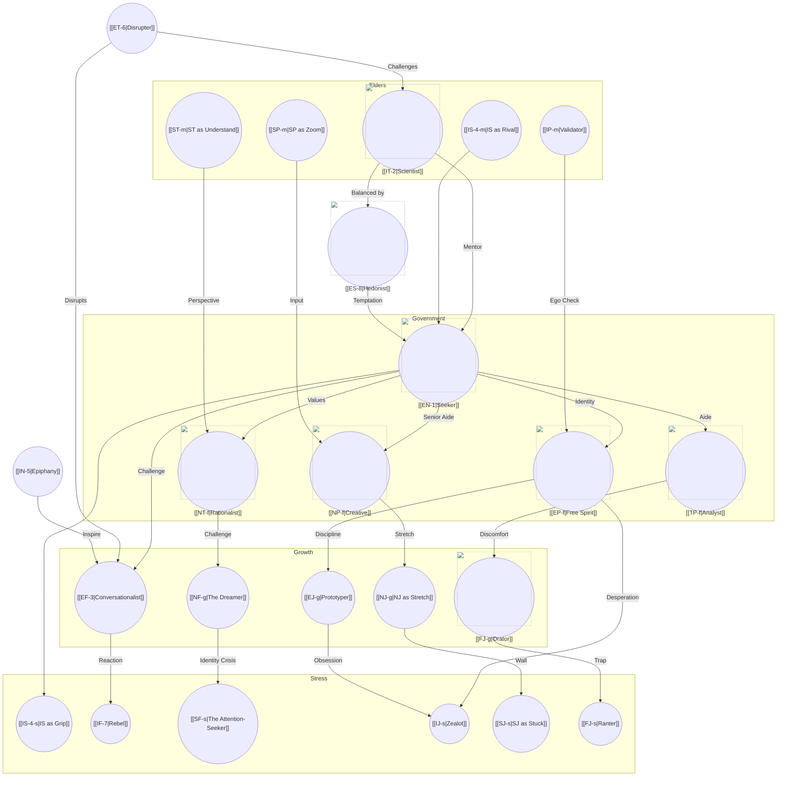

title: ENTP
menu: true

```mermaid
graph TD
%%classDef default width:25%;


Muse(("[[IN-5|Epiphany]]"))

Leader(("<img width=200 height=200 src='https://www.personality-database.com/profile_images/3024.png?id=0'><br>[[EN-1|Seeker]]"))

Fool(("[[ET-6|Disrupter]]"))

Priest(("<img width=200 height=200 src='https://www.personality-database.com/profile_images/3065.png?id=98502'><br>[[NT-f|Rationalist]]"))

Attitude(("<img width=200 height=200 src='https://www.personality-database.com/profile_images/3029.png?id=0'><br>[[EP-f|Free Spirit]]"))

CoreInt(("<img width=200 height=200 src='https://www.personality-database.com/profile_images/776.png?id=0'><br>[[NP-f|Creative]]"))

SuppInt(("<img width=200 height=200 src='https://www.personality-database.com/profile_images/7552.png?=33781'><br>[[TP-f|Analyst]]"))

Grip(("[[IS-4-s|IS as Grip]]"))

Vuln(("[[IF-7|Rebel]]"))

Crisis(("[[SF-s|The Attention-Seeker]]"))

Desperation(("[[IJ-s|Zealot]]"))

Stuck(("[[SJ-s|SJ as Stuck]]"))

Trap(("[[FJ-s|Ranter]]"))

Rival(("[[IS-4-m|IS as Rival]]"))

Adviser(("<img width=200 height=200 src='https://www.personality-database.com/profile_images/539.png?=0'><br>[[IT-2|Scientist]]"))

Villain(("<img width=200 height=200 src='https://www.personality-database.com/profile_images/762.png?id=126604'><br>[[ES-8|Hedonist]]"))

EgoCheck(("[[IP-m|Validator]]"))

Zoom(("[[SP-m|SP as Zoom]]"))

Understand(("[[ST-m|ST as Understand]]"))

Apprentice(("[[EF-3|Conversationalist]]"))

Stretch(("[[NJ-g|NJ as Stretch]]"))

Discipline(("[[EJ-g|Prototyper]]"))

Mindset(("[[NF-g|The Dreamer]]"))

Discomfort(("<img width=200 height=200 src='https://www.personality-database.com/profile_images/3023.png?id=0'><br>[[FJ-g|Orator]]"))


subgraph Government
    Leader -->|Values|Priest
    Leader -->|Identity|Attitude
    Leader -->|"Senior Aide"|CoreInt
    Leader --> |"Aide"|SuppInt
end


subgraph Stress
    Vuln
    Crisis
    Stuck
    Trap
    Attitude -->|Desperation|Desperation
    Leader ---> Grip 
end


subgraph Elders
    Adviser --> |Mentor|Leader
    EgoCheck --> |"Ego Check"|Attitude
    Zoom -->|Input|CoreInt
    Understand -->|Perspective|Priest
    Rival --> Leader
end

Adviser -->|Balanced by|Villain
%%Vuln --->|Criticism| Fool 

subgraph Growth
    Leader --> |Challenge|Apprentice
    Stretch
    Priest -->|Challenge|Mindset
    Discipline
    Discomfort
    Apprentice -->|Reaction|Vuln
end

Attitude -->|Discipline|Discipline
Discipline -->|Obsession|Desperation

CoreInt --> |Stretch|Stretch
SuppInt -->|Discomfort|Discomfort
Discomfort --> |Trap|Trap

Stretch --> |Wall|Stuck

Mindset -->|Identity Crisis|Crisis

%% Rival - Inf - 4
%%Rival -->|Challenge|Leader
%%Adviser -->|Mediate|Rival

%% Villain - Demon - 8
Villain --> |Temptation|Leader

%% Fool/Critic - 6
%%Fool -->|Feeds|Rival
Fool -->|Disrupts| Apprentice
%%Adviser --->|Challenged by|Fool
Fool -->|Challenges|Adviser

%% Muse - Opp - 5
Muse -->|Inspire|Apprentice

```