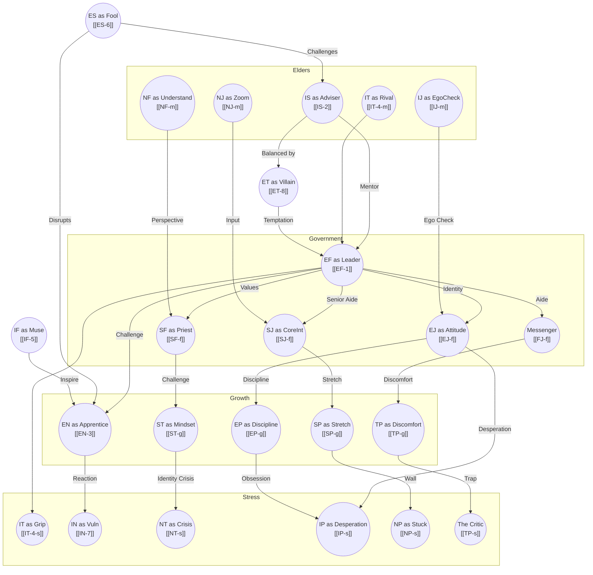

title: ESFJ
menu: true

```mermaid
graph TD
%%classDef default width:25%;


Muse(("IF as Muse<br>[[IF-5]]"))

Leader(("EF as Leader<br>[[EF-1]]"))

Fool(("ES as Fool<br>[[ES-6]]"))

Priest(("SF as Priest<br>[[SF-f]]"))

Attitude(("EJ as Attitude<br>[[EJ-f]]"))

CoreInt(("SJ as CoreInt<br>[[SJ-f]]"))

SuppInt(("Messenger<br>[[FJ-f]]"))

Grip(("IT as Grip<br>[[IT-4-s]]"))

Vuln(("IN as Vuln<br>[[IN-7]]"))

Crisis(("NT as Crisis<br>[[NT-s]]"))

Desperation(("IP as Desperation<br>[[IP-s]]"))

Stuck(("NP as Stuck<br>[[NP-s]]"))

Trap(("The Critic<br>[[TP-s]]"))

Rival(("IT as Rival<br>[[IT-4-m]]"))

Adviser(("IS as Adviser<br>[[IS-2]]"))

Villain(("ET as Villain<br>[[ET-8]]"))

EgoCheck(("IJ as EgoCheck<br>[[IJ-m]]"))

Zoom(("NJ as Zoom<br>[[NJ-m]]"))

Understand(("NF as Understand<br>[[NF-m]]"))

Apprentice(("EN as Apprentice<br>[[EN-3]]"))

Stretch(("SP as Stretch<br>[[SP-g]]"))

Discipline(("EP as Discipline<br>[[EP-g]]"))

Mindset(("ST as Mindset<br>[[ST-g]]"))

Discomfort(("TP as Discomfort<br>[[TP-g]]"))


subgraph Government
    Leader -->|Values|Priest
    Leader -->|Identity|Attitude
    Leader -->|"Senior Aide"|CoreInt
    Leader --> |"Aide"|SuppInt
end


subgraph Stress
    Vuln
    Crisis
    Stuck
    Trap
    Attitude -->|Desperation|Desperation
    Leader ---> Grip 
end


subgraph Elders
    Adviser --> |Mentor|Leader
    EgoCheck --> |"Ego Check"|Attitude
    Zoom -->|Input|CoreInt
    Understand -->|Perspective|Priest
    Rival --> Leader
end

Adviser -->|Balanced by|Villain
%%Vuln --->|Criticism| Fool 

subgraph Growth
    Leader --> |Challenge|Apprentice
    Stretch
    Priest -->|Challenge|Mindset
    Discipline
    Discomfort
    Apprentice -->|Reaction|Vuln
end

Attitude -->|Discipline|Discipline
Discipline -->|Obsession|Desperation

CoreInt --> |Stretch|Stretch
SuppInt -->|Discomfort|Discomfort
Discomfort --> |Trap|Trap

Stretch --> |Wall|Stuck

Mindset -->|Identity Crisis|Crisis

%% Rival - Inf - 4
%%Rival -->|Challenge|Leader
%%Adviser -->|Mediate|Rival

%% Villain - Demon - 8
Villain --> |Temptation|Leader

%% Fool/Critic - 6
%%Fool -->|Feeds|Rival
Fool -->|Disrupts| Apprentice
%%Adviser --->|Challenged by|Fool
Fool -->|Challenges|Adviser

%% Muse - Opp - 5
Muse -->|Inspire|Apprentice

```