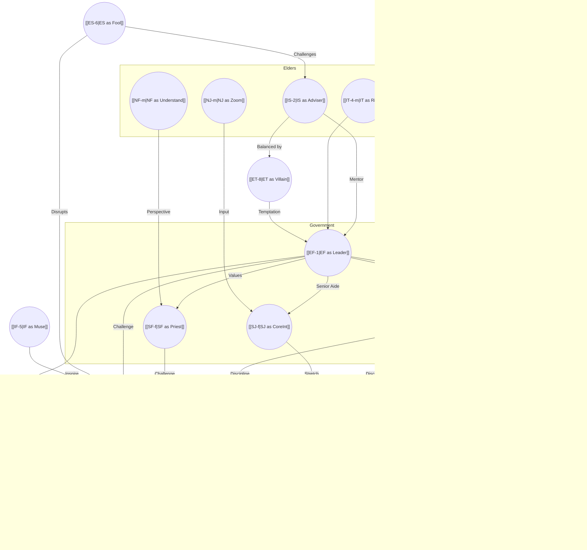

title: ESFJ
menu: true

```mermaid
graph TD
%%classDef default width:25%;


Muse(("[[IF-5|IF as Muse]]"))

Leader(("[[EF-1|EF as Leader]]"))

Fool(("[[ES-6|ES as Fool]]"))

Priest(("[[SF-f|SF as Priest]]"))

Attitude(("[[EJ-f|EJ as Attitude]]"))

CoreInt(("[[SJ-f|SJ as CoreInt]]"))

SuppInt(("<img width=200 height=200 src='https://www.personality-database.com/profile_images/3040.png?=0'><br>[[FJ-f|Messenger]]"))

Grip(("[[IT-4-s|IT as Grip]]"))

Vuln(("[[IN-7|IN as Vuln]]"))

Crisis(("[[NT-s|NT as Crisis]]"))

Desperation(("[[IP-s|IP as Desperation]]"))

Stuck(("[[NP-s|NP as Stuck]]"))

Trap(("[[TP-s|The Critic]]"))

Rival(("[[IT-4-m|IT as Rival]]"))

Adviser(("[[IS-2|IS as Adviser]]"))

Villain(("[[ET-8|ET as Villain]]"))

EgoCheck(("[[IJ-m|IJ as EgoCheck]]"))

Zoom(("[[NJ-m|NJ as Zoom]]"))

Understand(("[[NF-m|NF as Understand]]"))

Apprentice(("[[EN-3|EN as Apprentice]]"))

Stretch(("[[SP-g|SP as Stretch]]"))

Discipline(("[[EP-g|EP as Discipline]]"))

Mindset(("[[ST-g|ST as Mindset]]"))

Discomfort(("[[TP-g|TP as Discomfort]]"))


subgraph Government
    Leader -->|Values|Priest
    Leader -->|Identity|Attitude
    Leader -->|"Senior Aide"|CoreInt
    Leader --> |"Aide"|SuppInt
end


subgraph Stress
    Vuln
    Crisis
    Stuck
    Trap
    Attitude -->|Desperation|Desperation
    Leader ---> Grip 
end


subgraph Elders
    Adviser --> |Mentor|Leader
    EgoCheck --> |"Ego Check"|Attitude
    Zoom -->|Input|CoreInt
    Understand -->|Perspective|Priest
    Rival --> Leader
end

Adviser -->|Balanced by|Villain
%%Vuln --->|Criticism| Fool 

subgraph Growth
    Leader --> |Challenge|Apprentice
    Stretch
    Priest -->|Challenge|Mindset
    Discipline
    Discomfort
    Apprentice -->|Reaction|Vuln
end

Attitude -->|Discipline|Discipline
Discipline -->|Obsession|Desperation

CoreInt --> |Stretch|Stretch
SuppInt -->|Discomfort|Discomfort
Discomfort --> |Trap|Trap

Stretch --> |Wall|Stuck

Mindset -->|Identity Crisis|Crisis

%% Rival - Inf - 4
%%Rival -->|Challenge|Leader
%%Adviser -->|Mediate|Rival

%% Villain - Demon - 8
Villain --> |Temptation|Leader

%% Fool/Critic - 6
%%Fool -->|Feeds|Rival
Fool -->|Disrupts| Apprentice
%%Adviser --->|Challenged by|Fool
Fool -->|Challenges|Adviser

%% Muse - Opp - 5
Muse -->|Inspire|Apprentice

```