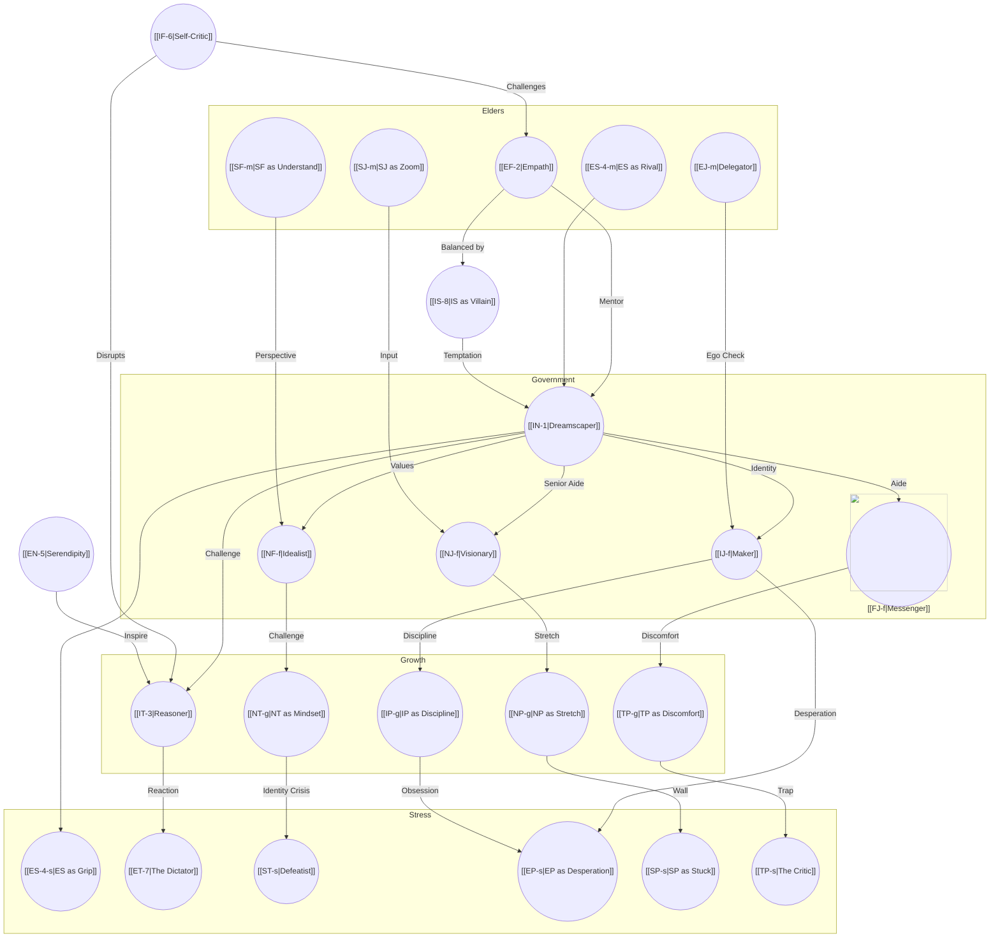

title: INFJ
menu: true

```mermaid
graph TD
%%classDef default width:25%;


Muse(("[[EN-5|Serendipity]]"))

Leader(("[[IN-1|Dreamscaper]]"))

Fool(("[[IF-6|Self-Critic]]"))

Priest(("[[NF-f|Idealist]]"))

Attitude(("[[IJ-f|Maker]]"))

CoreInt(("[[NJ-f|Visionary]]"))

SuppInt(("<img width=200 height=200 src='https://www.personality-database.com/profile_images/3040.png?=0'><br>[[FJ-f|Messenger]]"))

Grip(("[[ES-4-s|ES as Grip]]"))

Vuln(("[[ET-7|The Dictator]]"))

Crisis(("[[ST-s|Defeatist]]"))

Desperation(("[[EP-s|EP as Desperation]]"))

Stuck(("[[SP-s|SP as Stuck]]"))

Trap(("[[TP-s|The Critic]]"))

Rival(("[[ES-4-m|ES as Rival]]"))

Adviser(("[[EF-2|Empath]]"))

Villain(("[[IS-8|IS as Villain]]"))

EgoCheck(("[[EJ-m|Delegator]]"))

Zoom(("[[SJ-m|SJ as Zoom]]"))

Understand(("[[SF-m|SF as Understand]]"))

Apprentice(("[[IT-3|Reasoner]]"))

Stretch(("[[NP-g|NP as Stretch]]"))

Discipline(("[[IP-g|IP as Discipline]]"))

Mindset(("[[NT-g|NT as Mindset]]"))

Discomfort(("[[TP-g|TP as Discomfort]]"))


subgraph Government
    Leader -->|Values|Priest
    Leader -->|Identity|Attitude
    Leader -->|"Senior Aide"|CoreInt
    Leader --> |"Aide"|SuppInt
end


subgraph Stress
    Vuln
    Crisis
    Stuck
    Trap
    Attitude -->|Desperation|Desperation
    Leader ---> Grip 
end


subgraph Elders
    Adviser --> |Mentor|Leader
    EgoCheck --> |"Ego Check"|Attitude
    Zoom -->|Input|CoreInt
    Understand -->|Perspective|Priest
    Rival --> Leader
end

Adviser -->|Balanced by|Villain
%%Vuln --->|Criticism| Fool 

subgraph Growth
    Leader --> |Challenge|Apprentice
    Stretch
    Priest -->|Challenge|Mindset
    Discipline
    Discomfort
    Apprentice -->|Reaction|Vuln
end

Attitude -->|Discipline|Discipline
Discipline -->|Obsession|Desperation

CoreInt --> |Stretch|Stretch
SuppInt -->|Discomfort|Discomfort
Discomfort --> |Trap|Trap

Stretch --> |Wall|Stuck

Mindset -->|Identity Crisis|Crisis

%% Rival - Inf - 4
%%Rival -->|Challenge|Leader
%%Adviser -->|Mediate|Rival

%% Villain - Demon - 8
Villain --> |Temptation|Leader

%% Fool/Critic - 6
%%Fool -->|Feeds|Rival
Fool -->|Disrupts| Apprentice
%%Adviser --->|Challenged by|Fool
Fool -->|Challenges|Adviser

%% Muse - Opp - 5
Muse -->|Inspire|Apprentice

```