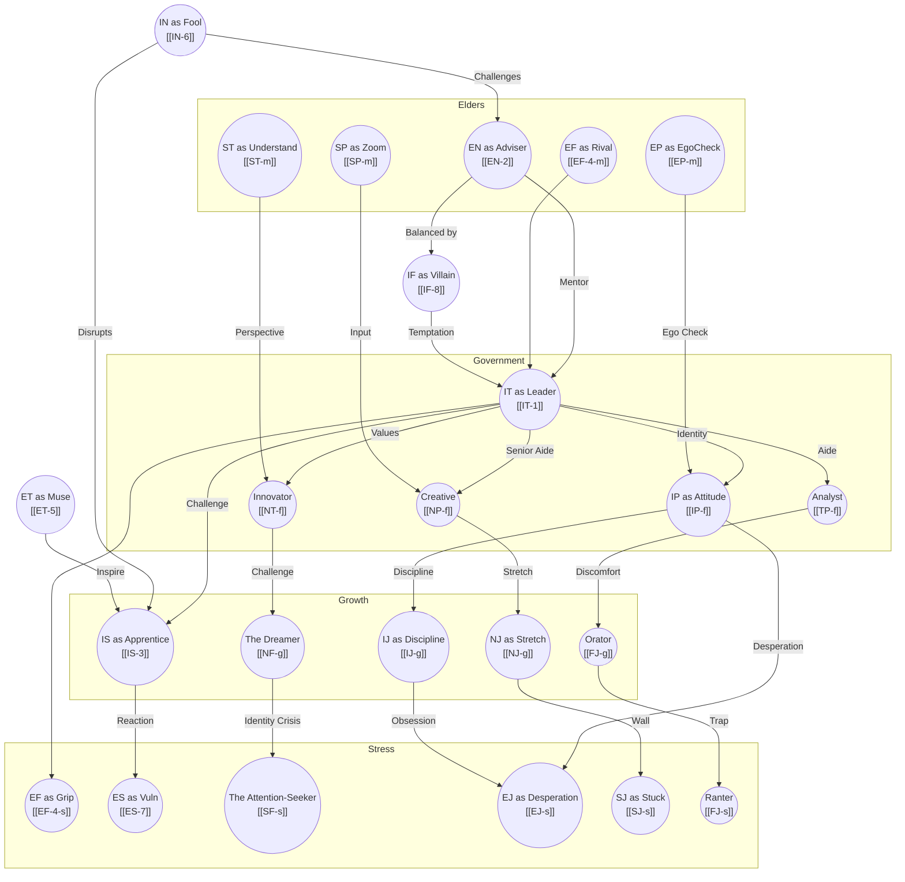

title: INTP
menu: true

```mermaid
graph TD
%%classDef default width:25%;


Muse(("ET as Muse<br>[[ET-5]]"))

Leader(("IT as Leader<br>[[IT-1]]"))

Fool(("IN as Fool<br>[[IN-6]]"))

Priest(("Innovator<br>[[NT-f]]"))

Attitude(("IP as Attitude<br>[[IP-f]]"))

CoreInt(("Creative<br>[[NP-f]]"))

SuppInt(("Analyst<br>[[TP-f]]"))

Grip(("EF as Grip<br>[[EF-4-s]]"))

Vuln(("ES as Vuln<br>[[ES-7]]"))

Crisis(("The Attention-Seeker<br>[[SF-s]]"))

Desperation(("EJ as Desperation<br>[[EJ-s]]"))

Stuck(("SJ as Stuck<br>[[SJ-s]]"))

Trap(("Ranter<br>[[FJ-s]]"))

Rival(("EF as Rival<br>[[EF-4-m]]"))

Adviser(("EN as Adviser<br>[[EN-2]]"))

Villain(("IF as Villain<br>[[IF-8]]"))

EgoCheck(("EP as EgoCheck<br>[[EP-m]]"))

Zoom(("SP as Zoom<br>[[SP-m]]"))

Understand(("ST as Understand<br>[[ST-m]]"))

Apprentice(("IS as Apprentice<br>[[IS-3]]"))

Stretch(("NJ as Stretch<br>[[NJ-g]]"))

Discipline(("IJ as Discipline<br>[[IJ-g]]"))

Mindset(("The Dreamer<br>[[NF-g]]"))

Discomfort(("Orator<br>[[FJ-g]]"))


subgraph Government
    Leader -->|Values|Priest
    Leader -->|Identity|Attitude
    Leader -->|"Senior Aide"|CoreInt
    Leader --> |"Aide"|SuppInt
end


subgraph Stress
    Vuln
    Crisis
    Stuck
    Trap
    Attitude -->|Desperation|Desperation
    Leader ---> Grip 
end


subgraph Elders
    Adviser --> |Mentor|Leader
    EgoCheck --> |"Ego Check"|Attitude
    Zoom -->|Input|CoreInt
    Understand -->|Perspective|Priest
    Rival --> Leader
end

Adviser -->|Balanced by|Villain
%%Vuln --->|Criticism| Fool 

subgraph Growth
    Leader --> |Challenge|Apprentice
    Stretch
    Priest -->|Challenge|Mindset
    Discipline
    Discomfort
    Apprentice -->|Reaction|Vuln
end

Attitude -->|Discipline|Discipline
Discipline -->|Obsession|Desperation

CoreInt --> |Stretch|Stretch
SuppInt -->|Discomfort|Discomfort
Discomfort --> |Trap|Trap

Stretch --> |Wall|Stuck

Mindset -->|Identity Crisis|Crisis

%% Rival - Inf - 4
%%Rival -->|Challenge|Leader
%%Adviser -->|Mediate|Rival

%% Villain - Demon - 8
Villain --> |Temptation|Leader

%% Fool/Critic - 6
%%Fool -->|Feeds|Rival
Fool -->|Disrupts| Apprentice
%%Adviser --->|Challenged by|Fool
Fool -->|Challenges|Adviser

%% Muse - Opp - 5
Muse -->|Inspire|Apprentice

```