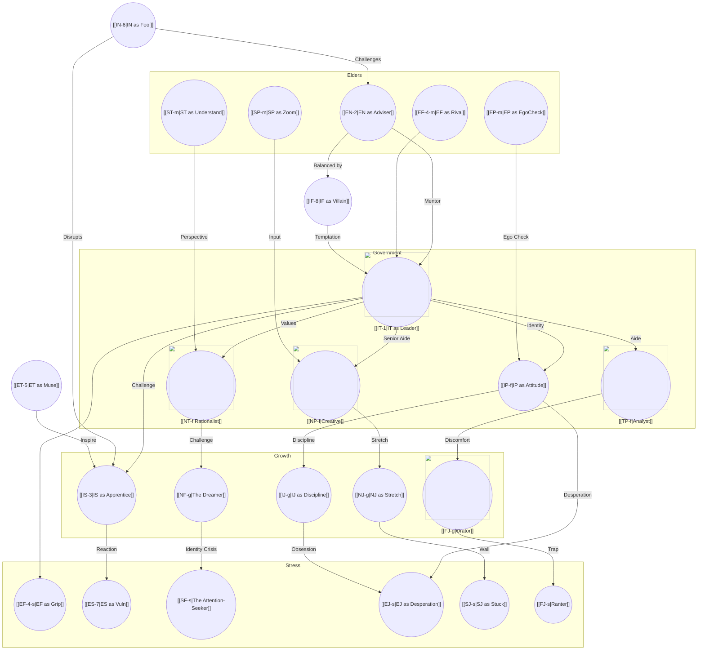

title: INTP
menu: true

```mermaid
graph TD
%%classDef default width:25%;


Muse(("[[ET-5|ET as Muse]]"))

Leader(("<img width=200 height=200 src='https://www.personality-database.com/profile_images/395.png?=0'><br>[[IT-1|IT as Leader]]"))

Fool(("[[IN-6|IN as Fool]]"))

Priest(("<img width=200 height=200 src='https://www.personality-database.com/profile_images/3065.png?id=98502'><br>[[NT-f|Rationalist]]"))

Attitude(("[[IP-f|IP as Attitude]]"))

CoreInt(("<img width=200 height=200 src='https://www.personality-database.com/profile_images/776.png?id=0'><br>[[NP-f|Creative]]"))

SuppInt(("<img width=200 height=200 src='https://www.personality-database.com/profile_images/7552.png?=33781'><br>[[TP-f|Analyst]]"))

Grip(("[[EF-4-s|EF as Grip]]"))

Vuln(("[[ES-7|ES as Vuln]]"))

Crisis(("[[SF-s|The Attention-Seeker]]"))

Desperation(("[[EJ-s|EJ as Desperation]]"))

Stuck(("[[SJ-s|SJ as Stuck]]"))

Trap(("[[FJ-s|Ranter]]"))

Rival(("[[EF-4-m|EF as Rival]]"))

Adviser(("[[EN-2|EN as Adviser]]"))

Villain(("[[IF-8|IF as Villain]]"))

EgoCheck(("[[EP-m|EP as EgoCheck]]"))

Zoom(("[[SP-m|SP as Zoom]]"))

Understand(("[[ST-m|ST as Understand]]"))

Apprentice(("[[IS-3|IS as Apprentice]]"))

Stretch(("[[NJ-g|NJ as Stretch]]"))

Discipline(("[[IJ-g|IJ as Discipline]]"))

Mindset(("[[NF-g|The Dreamer]]"))

Discomfort(("<img width=200 height=200 src='https://www.personality-database.com/profile_images/3023.png?id=0'><br>[[FJ-g|Orator]]"))


subgraph Government
    Leader -->|Values|Priest
    Leader -->|Identity|Attitude
    Leader -->|"Senior Aide"|CoreInt
    Leader --> |"Aide"|SuppInt
end


subgraph Stress
    Vuln
    Crisis
    Stuck
    Trap
    Attitude -->|Desperation|Desperation
    Leader ---> Grip 
end


subgraph Elders
    Adviser --> |Mentor|Leader
    EgoCheck --> |"Ego Check"|Attitude
    Zoom -->|Input|CoreInt
    Understand -->|Perspective|Priest
    Rival --> Leader
end

Adviser -->|Balanced by|Villain
%%Vuln --->|Criticism| Fool 

subgraph Growth
    Leader --> |Challenge|Apprentice
    Stretch
    Priest -->|Challenge|Mindset
    Discipline
    Discomfort
    Apprentice -->|Reaction|Vuln
end

Attitude -->|Discipline|Discipline
Discipline -->|Obsession|Desperation

CoreInt --> |Stretch|Stretch
SuppInt -->|Discomfort|Discomfort
Discomfort --> |Trap|Trap

Stretch --> |Wall|Stuck

Mindset -->|Identity Crisis|Crisis

%% Rival - Inf - 4
%%Rival -->|Challenge|Leader
%%Adviser -->|Mediate|Rival

%% Villain - Demon - 8
Villain --> |Temptation|Leader

%% Fool/Critic - 6
%%Fool -->|Feeds|Rival
Fool -->|Disrupts| Apprentice
%%Adviser --->|Challenged by|Fool
Fool -->|Challenges|Adviser

%% Muse - Opp - 5
Muse -->|Inspire|Apprentice

```