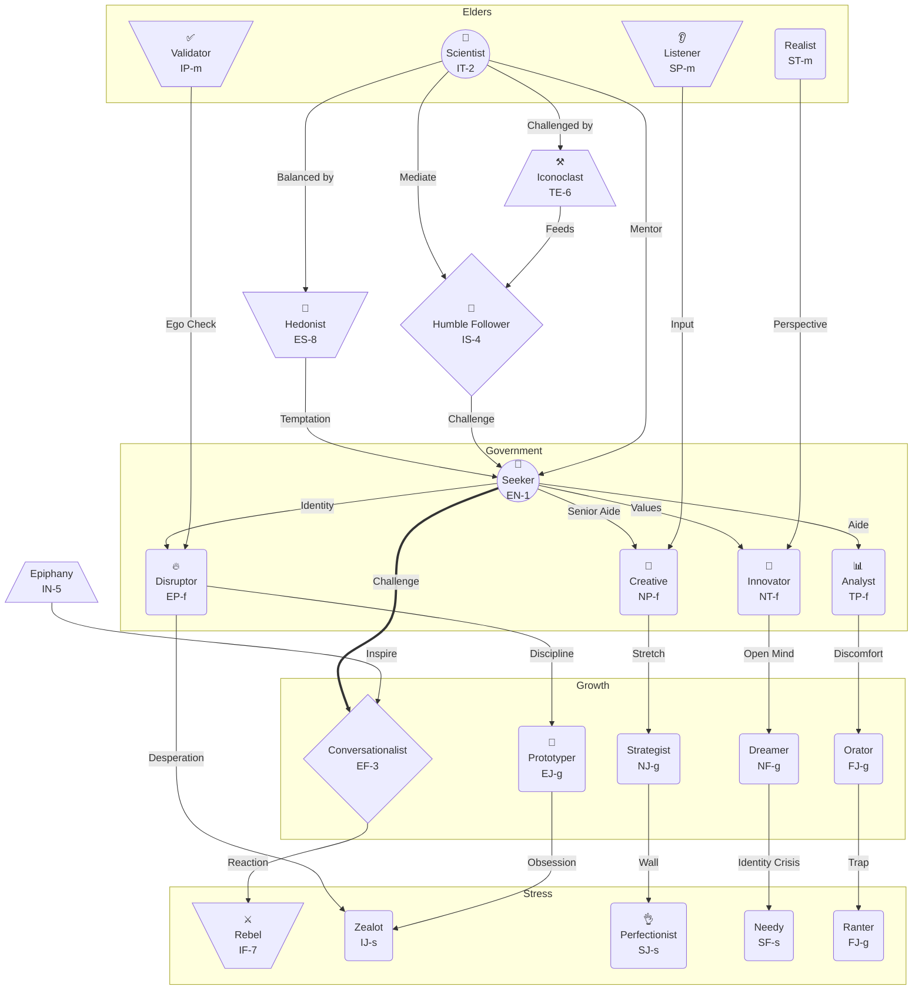

title: ENTP Example

```mermaid

graph TD

Muse[/"Epiphany<br>IN-5"\]

%% Flow Roles
Leader(("🧭<br>Seeker<br>EN-1"))
Priest("🤔<br>Innovator<br>NT-f")
Attitude("🔥<br>Disruptor<br>EP-f")
Fool[/"⚒️<br>Iconoclast<br>TE-6<br>"\]
CoreInt("🎨<br>Creative<br>NP-f")
SuppInt("📊<br>Analyst<br>TP-f")

%% Stress Roles
Rival{"🙏<br>Humble Follower<br>IS-4"}
Vuln[\"⚔️<br>Rebel<br>IF-7"/]
Desperation("Zealot<br>IJ-s")
Stuck("👌<br>Perfectionist<br>SJ-s")
Crisis("Needy<br>SF-s")
Trap("Ranter<br>FJ-g")

%% Mentor Roles
Adviser(("🥼<br>Scientist<br>IT-2"))
Villain[\"🍹<br>Hedonist<br>ES-8"/]
EgoCheck[\"✅<br>Validator<br>IP-m"/]
Zoom[\"👂<br>Listener<br>SP-m"/]
Understand("Realist<br>ST-m")

%% Growth Roles
Apprentice{"Conversationalist<br>EF-3"}
Stretch("Strategist<br>NJ-g")
Discipline("🚂<br>Prototyper<br>EJ-g")
Mindset("Dreamer<br>NF-g")
Discomfort("Orator<br>FJ-g")

subgraph Government
Leader -->|Values|Priest
Leader -->|Identity|Attitude
Leader -->|"Senior Aide"|CoreInt
Leader --> |"Aide"|SuppInt
end

Villain --> |Temptation|Leader

subgraph Stress
Vuln
Desperation
Crisis
Stuck
Trap
end

Adviser -->|Mediate|Rival
Rival -->|Challenge|Leader
Attitude -->|Desperation|Desperation
Fool -->|Feeds|Rival

subgraph Elders
Adviser --> |Mentor|Leader
EgoCheck --> |"Ego Check"|Attitude
Zoom -->|Input|CoreInt
Understand -->|Perspective|Priest
end

Adviser -->|Balanced by|Villain

subgraph Growth
Leader ==> |Challenge|Apprentice
Stretch
Priest -->|Open Mind|Mindset
Discipline
Discomfort
end

Attitude -->|Discipline|Discipline
Discipline -->|Obsession|Desperation

CoreInt --> |Stretch|Stretch
SuppInt -->|Discomfort|Discomfort
Discomfort --> |Trap|Trap

Adviser -->|Challenged by|Fool
%%Fool --> |Critique|Adviser
Muse -->|Inspire|Apprentice
Stretch --> |Wall|Stuck

Mindset -->|Identity Crisis|Crisis

Apprentice -->|Reaction|Vuln

```
